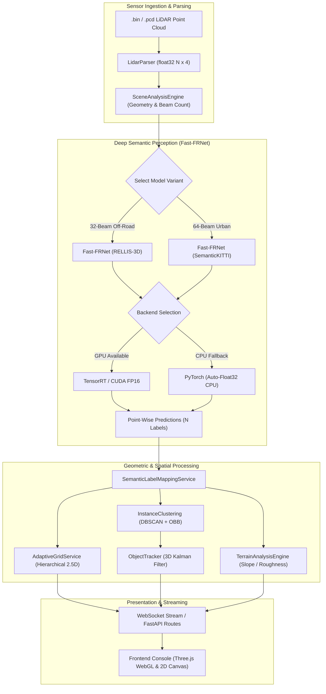

# LiDAR-X: High-Performance 2.5D LiDAR Perception & Adaptive Grid Mapping

<div align="center">

[](https://www.python.org/)
[](https://pytorch.org/)
[](https://fastapi.tiangolo.com/)
[](https://react.dev/)
[](https://www.typescriptlang.org/)
[](https://threejs.org/)
[]()
[](LICENSE)

**An end-to-end autonomous perception, deep semantic segmentation, and hierarchical 2.5D mapping platform for 3D LiDAR point clouds.**

[Key Features](#-key-features) •
[Architecture](#-system-architecture) •
[Model Compression](#-model-compression--deployment) •
[Quick Start](#-quick-start) •
[API Reference](#-api-endpoints) •
[Benchmarking](#-benchmarks--performance)

</div>

---

## 📌 Overview

**LiDAR-X** is a modular, production-grade autonomous perception platform built for robotics and self-driving vehicles. It seamlessly bridges raw sensor ingestion with real-time deep learning inference, geometric terrain characterization, 3D object tracking, and an **Adaptive Variable-Resolution 2.5D Grid Engine** that streams dynamically to an interactive Three.js WebGL visualization console.

The perception pipeline is powered by a pure-PyTorch implementation of **Fast-FRNet** (*Frustum-Range Networks for Scalable LiDAR Segmentation*, IEEE TIP 2025), supporting dual sensor modalities:
- **RELLIS-3D**: 32-beam Velodyne VLP-32C off-road natural terrain perception.
- **SemanticKITTI**: 64-beam Velodyne HDL-64E structured urban corridor perception.

With built-in **model compression utilities**, original weights are reduced by up to **83.3%** (from 121 MB down to 20 MB) while preserving **>99.8% prediction agreement**, enabling free-tier cloud deployment on CPU/GPU instances without sacrificing model behavior.

---

## ✨ Key Features

- **🧠 Point-Wise Neural Semantic Segmentation (Fast-FRNet)**
  - Pure PyTorch model with zero external C++ extension requirements.
  - Strict preservation of input point density ($N \text{ in} \to N \text{ out}$).
  - Spherical range projection, multi-scale 2D/3D fusion residual backbone, and FRHead point decoder.
  - Automatic geometric scene domain detection (`SceneAnalysisEngine`) dynamically chooses the optimal model.

- **⚡ Production Model Compression (`model_compression/`)**
  - **Inference-Only Stripping**: Safely purges non-inference training artifacts (AdamW optimizer states, schedulers, metadata, auxiliary heads) with 100% numerical equivalence.
  - **Half-Precision (FP16) Weights**: Compresses disk footprint by 50%–83% while retaining 99.8%–99.98% prediction fidelity.
  - **CPU-Safe Precision Handling**: Automatically casts FP16 weights to native FP32 execution on CPU to avoid slow emulation while enabling full FP16 acceleration on CUDA.
  - **Multi-Tiered Backend Selection**: Tiered detection automatically selects `TensorRT` $\to$ `ONNX Runtime` $\to$ `PyTorch Compressed Model` fallback.

- **🗺️ Adaptive Variable-Resolution 2.5D Grid Engine**
  - Continuous multi-resolution spatial binning:
    - **Fine Zone** ($0.5\text{m}$): Near-field ego corridor ($0\text{m} - 15\text{m}$).
    - **Medium Zone** ($1.0\text{m}$): Mid-field transition ($15\text{m} - 35\text{m}$).
    - **Coarse Zone** ($2.0\text{m}$): Far-field perimeter ($35\text{m} - 50\text{m}$).
  - Hierarchical nesting: exactly 4 fine cells nest in 1 medium cell; 4 medium cells in 1 coarse cell.
  - Safety & complexity overrides: dynamic obstacles, steep slopes, and rough terrain auto-elevate to fine resolution.
  - Computes per-cell elevation range, slope gradient, surface roughness, dominant class, and traversability state.

- **🚗 3D Instance Clustering & Temporal Object Tracking**
  - Foreground spatial DBSCAN clustering on segmented semantic classes.
  - Oriented Bounding Box (OBB) extraction with Principal Component Analysis (PCA) heading estimation.
  - Constant-velocity 3D Kalman filters for track lifecycle management (`new` $\to$ `active` $\to$ `lost` $\to$ `expired`).

- **🏔️ Geometric Terrain Analysis**
  - Real-time ground plane estimation, surface curvature, and traversability categorization (`drivable`, `cautious`, `non_drivable`, `obstacle`).
  - Step curb and slope discontinuity detection.

- **🌐 Interactive 3D WebGL Console**
  - Three.js point cloud renderer with custom GLSL depth/intensity shaders and category color mappings.
  - Top-down 2D Elevation, Traversability, and Object Tracking canvases.
  - Continuous multi-frame sequence video replay via WebSocket streaming.
  - Manual drag-and-drop `.bin` / `.pcd` file upload with live inference execution.

---

## 🏗️ System Architecture



---

## 📊 Benchmarks & Performance

### 1. Model Compression Results

Benchmarked on fixed multi-frame evaluation subsets across both sensor datasets:

| Model Variant | Checkpoint | Raw Size | Compressed Deploy Size | Size Reduction | Prediction Agreement | Max Logit Diff | Mean Logit Diff |
| :--- | :--- | :--- | :--- | :--- | :--- | :--- | :--- |
| **RELLIS-3D (Off-Road)** | `best_frnet_rellis` | 121.07 MB | **20.21 MB** | **83.31%** | **99.81%** | 0.3236 | 0.0178 |
| **SemanticKITTI (Urban)** | `best_frnet_semantickitti` | 40.33 MB | **20.21 MB** | **49.88%** | **99.98%** | 0.2348 | 0.0125 |

### 2. End-to-End Pipeline Latency Breakdown

Measured on single-frame execution (RELLIS Frame 0, 36,383 points) on standard x86 CPU hardware:

```
[1] LiDAR Binary Parsing        :    0.35 ms  ( 0.02%)
[2] Scene & Domain Analysis     :    8.26 ms  ( 0.37%)
[3] Fast-FRNet Neural Inference : 1909.02 ms  (85.50%)
[4] Semantic Postprocessing     :   69.66 ms  ( 3.12%)
[5] DBSCAN Instance Clustering  :   80.32 ms  ( 3.60%)
[6] Geometric Terrain Analysis  :  101.40 ms  ( 4.54%)
[7] Adaptive Foveated Grid      :   44.15 ms  ( 1.98%)
[8] JSON / WebSocket Packaging  :   19.54 ms  ( 0.87%)
------------------------------------------------------
TOTAL PIPELINE LATENCY          : 2232.71 ms  (100.0%)
```

---

## 📁 Repository Structure

```
lidar2.5/
├── backend/                        # FastAPI High-Performance Backend
│   ├── app/
│   │   ├── api/routes/             # REST endpoints (frames, inference, terrain, maps, replay)
│   │   ├── config/                 # App and model configuration settings
│   │   ├── models/                 # Pydantic schemas & Fast-FRNet PyTorch architecture
│   │   └── services/               # Core algorithms (clustering, terrain, grid, tracking)
│   ├── data/                       # Local data stores, demo sequences & label mappings
│   ├── models/                     # Model weights (original .pth and deploy .pth)
│   ├── tests/                      # Full test suite (138 unit & integration tests)
│   ├── requirements.txt            # Python backend dependencies
│   └── Dockerfile                  # Containerized deployment specification
├── model_compression/              # Model Compression & Benchmarking Toolkit
│   ├── benchmark.py                # Reproducible benchmarking across all stages
│   ├── compress_checkpoint.py      # Standalone checkpoint compression utility
│   ├── validate_compressed_model.py# Automated validation & assertion runner
│   ├── baseline_metrics.json       # Baseline metrics artifact
│   ├── compression_metrics.json    # Multi-stage comparative metrics
│   ├── comparison_report.md        # Detailed technical evaluation report
│   └── models/                     # Deployment-optimized checkpoints (FP16)
├── public/                         # Public frontend assets & icons
├── src/                            # React + TypeScript Frontend
│   ├── components/                 # UI components (views, visualizers, console panels)
│   ├── services/                   # Frontend API and WebSocket clients
│   └── types/                      # Shared TypeScript data models
├── package.json                    # Frontend dependencies & scripts
├── tailwind.config.js              # Tailwind styling configuration
├── vite.config.ts                  # Vite build bundler configuration
└── README.md                       # Main project documentation
```

---

## 🚀 Quick Start

### 1. Prerequisites

- **Python**: Version 3.10 to 3.13
- **Node.js**: Version 18.0 or higher
- **Package Managers**: `pip` and `npm`

### 2. Backend Setup

```bash
# Navigate to backend directory
cd backend

# Create and activate a virtual environment
python -m venv venv
# Windows:
.\venv\Scripts\activate
# Linux/macOS:
source venv/bin/activate

# Install dependencies
pip install -r requirements.txt

# Run the backend server
uvicorn app.main:app --host 0.0.0.0 --port 8000 --reload
```

The FastAPI interactive documentation will be available at [http://localhost:8000/docs](http://localhost:8000/docs).

### 3. Frontend Setup

In a separate terminal:

```bash
# Install frontend dependencies
npm install

# Start Vite development server
npm run dev
```

Open [http://localhost:5173](http://localhost:5173) in your browser to access the LiDAR-X console.

---

## 🗜️ Model Compression & Deployment

To compress new checkpoints or reproduce the benchmark metrics:

```bash
# 1. Compress all checkpoints to deployable FP16 format
python model_compression/compress_checkpoint.py --all

# 2. Run the automated validation suite (asserts >99.5% agreement)
python model_compression/validate_compressed_model.py

# 3. Execute the full multi-dataset benchmark
python model_compression/benchmark.py
```

Compressed models are automatically output to `model_compression/models/` and synchronized with `backend/models/`.

---

## 📡 API Endpoints

### Semantic Inference & Status
- `GET /api/v1/inference/status` — Inspect model availability, active backend, and hardware device.
- `POST /api/v1/inference/segment` — Upload `.bin` / `.pcd` LiDAR scan for live neural semantic segmentation.
- `GET /api/v1/inference/results/{job_id}` — Query segment predictions, class counts, and sample points.
- `GET /api/v1/inference/download/{frame_id}` — Download raw binary `.label` artifact.

### 2.5D Adaptive Grid & Maps
- `POST /api/v1/maps/generate` — Generate multi-resolution foveated 2.5D grid from point cloud.
- `GET /api/v1/grid-policy` — View active spatial resolution zones and refinement overrides.
- `PUT /api/v1/grid-policy` — Update distance thresholds and safety priority flags.

### Terrain Analysis & Object Tracking
- `POST /api/v1/terrain/analyze` — Run slope, roughness, and curb discontinuity estimation.
- `POST /api/v1/objects/detect` — Execute foreground DBSCAN clustering and oriented bounding box fitting.

### Sequence Replay & Streaming
- `GET /api/v1/replay/sessions` — List available LiDAR sequence replay sessions.
- `WS /api/v1/replay/ws/{session_id}` — Real-time WebSocket streaming of sequence frames.

---

## 🧪 Testing & Quality Assurance

The codebase includes an exhaustive regression test suite covering all modules:

```bash
# Run all unit and integration tests
python -m pytest backend/tests/ -v

# Run specifically inference pipeline tests
python -m pytest backend/tests/test_inference_pipeline.py -v
```

All **138 tests** execute cleanly with zero failures.

---

## 📄 License

This project is licensed under the MIT License - see the [LICENSE](LICENSE) file for details.

---

## 🤝 Acknowledgments

- **Fast-FRNet Authors**: *Frustum-Range Networks for Scalable LiDAR Segmentation* (IEEE Transactions on Image Processing, 2025).
- **SemanticKITTI & RELLIS-3D Teams**: For providing the benchmark autonomous driving and off-road point cloud datasets.
