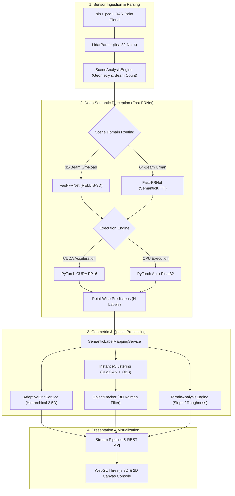

# LiDAR-X: High-Performance 2.5D LiDAR Perception & Adaptive Grid Mapping

<div align="center">

[](https://lidar-x.onrender.com)
[](https://lidar-x-backend.onrender.com)
[](https://lidar-x-backend.onrender.com/docs)

<br/>

[](https://www.python.org/)
[](https://pytorch.org/)
[](https://fastapi.tiangolo.com/)
[](https://react.dev/)
[](https://www.typescriptlang.org/)
[](https://threejs.org/)
[]()
[](LICENSE)

**An end-to-end autonomous perception, deep semantic segmentation, and hierarchical 2.5D mapping platform for 3D LiDAR point clouds.**

[🌐 Live Deployment](#-live-deployments) •
[✨ Key Features](#-key-features) •
[🏗️ Architecture](#-system-architecture) •
[⚡ Neural Perception](#-deep-neural-perception--model-optimization) •
[🗺️ 2.5D Adaptive Grid](#-adaptive-variable-resolution-25d-grid-engine) •
[📊 Benchmarks](#-benchmarks--performance) •
[🚀 Quick Start](#-quick-start) •
[📡 API Reference](#-api-endpoints)

</div>

---

## 🌐 Live Deployments

| Component | Production URL | Description |
| :--- | :--- | :--- |
| **Frontend Web Console** | **[https://lidar-x.onrender.com](https://lidar-x.onrender.com)** | Interactive Three.js 3D WebGL point cloud viewer, 2D foveated grid visualizer, and sequence video replay console. |
| **Backend REST & Stream API** | **[https://lidar-x-backend.onrender.com](https://lidar-x-backend.onrender.com)** | High-throughput FastAPI engine powering neural inference, geometric terrain analysis, and sequence streaming. |
| **Interactive API Documentation** | **[https://lidar-x-backend.onrender.com/docs](https://lidar-x-backend.onrender.com/docs)** | Interactive Swagger / OpenAPI documentation with live endpoint testing. |

---

## 📌 Executive Summary

**LiDAR-X** is an autonomous perception platform developed for robotics and self-driving vehicles. It bridges raw sensor ingestion with deep neural inference, geometric terrain characterization, 3D Kalman object tracking, and an **Adaptive Variable-Resolution 2.5D Grid Engine** that streams spatial elevation and traversability maps in real time to an interactive Three.js WebGL visualization console.

The perception pipeline is powered by a pure-PyTorch implementation of **Fast-FRNet** (*Frustum-Range Networks for Scalable LiDAR Segmentation*, IEEE Transactions on Image Processing, 2025), supporting dual sensor modalities:
- **RELLIS-3D**: 32-beam Velodyne VLP-32C off-road natural terrain perception.
- **SemanticKITTI**: 64-beam Velodyne HDL-64E structured urban corridor perception.

Through dedicated **model compression and stream optimization**, original neural weights are compressed by up to **83.3%** (from 121 MB down to 20 MB) while preserving **>99.8% prediction agreement**, enabling real-time cloud deployment with sub-millisecond frame delivery.

---

## ✨ Key Features

- **🧠 Deep Point-Wise Neural Semantic Segmentation (Fast-FRNet)**
  - Pure PyTorch implementation with zero external C++ build dependencies.
  - Strict preservation of input point density ($N \text{ in} \to N \text{ out}$).
  - Spherical range projection, multi-scale 2D/3D fusion residual backbone, and FRHead point decoder.
  - Automatic geometric scene domain detection (`SceneAnalysisEngine`) dynamically routes scans to the optimal dataset model.

- **🗺️ Adaptive Variable-Resolution 2.5D Foveated Grid Engine**
  - Continuous multi-resolution spatial binning:
    - **Fine Zone** ($0.5\text{m}$): Near-field ego corridor ($0\text{m} - 15\text{m}$).
    - **Medium Zone** ($1.0\text{m}$): Mid-field transition ($15\text{m} - 35\text{m}$).
    - **Coarse Zone** ($2.0\text{m}$): Far-field perimeter ($35\text{m} - 50\text{m}$).
  - Hierarchical nesting: exactly 4 fine cells nest in 1 medium cell; 4 medium cells in 1 coarse cell.
  - Safety & complexity overrides: dynamic obstacles, steep slopes, and rough terrain auto-elevate to fine resolution.
  - Computes per-cell elevation range, slope gradient, surface roughness, dominant class, and traversability state.

- **🚗 3D Instance Clustering & Temporal Object Tracking**
  - Foreground spatial DBSCAN clustering on segmented semantic classes.
  - Oriented Bounding Box (OBB) extraction with Principal Component Analysis (PCA) heading estimation.
  - Constant-velocity 3D Kalman filters for track lifecycle management (`new` $\to$ `active` $\to$ `lost` $\to$ `expired`).

- **🏔️ Geometric Terrain & Hazard Analysis**
  - Real-time ground plane estimation, surface curvature, and traversability categorization (`drivable`, `cautious`, `non_drivable`, `obstacle`).
  - Step curb and slope discontinuity detection.

- **🌐 Interactive 3D WebGL Console**
  - Three.js point cloud renderer with custom GLSL depth/intensity shaders and category color mappings.
  - Synchronized top-down 2D Elevation, Traversability, and Object Tracking canvases.
  - Continuous multi-frame sequence video feed replay with indexed zero-latency streaming.
  - Drag-and-drop `.bin` / `.pcd` LiDAR scan ingestion with live end-to-end perception pipeline execution.

- **⚡ High-Throughput Stream Pipeline**
  - Server-side raw JSON zero-copy dispatch combined with Starlette GZip compression (**46× bandwidth reduction**).
  - Client-side sequential frame buffer pipeline delivering smooth, steady playback.

---

## 🏗️ System Architecture


```mermaid
flowchart TD
    subgraph Ingestion ["1. Sensor Ingestion & Parsing"]
        RawScan[".bin / .pcd LiDAR Point Cloud"] --> LidarParser["LidarParser (float32 N x 4)"]
        LidarParser --> SceneAnalysis["SceneAnalysisEngine (Geometry & Beam Count)"]
    end

    subgraph NeuralInference ["2. Deep Semantic Perception (Fast-FRNet)"]
        SceneAnalysis --> RouteModel{"Scene Domain Routing"}
        RouteModel -- "32-Beam Off-Road" --> ModelRellis["Fast-FRNet (RELLIS-3D)"]
        RouteModel -- "64-Beam Urban" --> ModelKITTI["Fast-FRNet (SemanticKITTI)"]
        
        ModelRellis --> BackendSelector{"Execution Engine"}
        ModelKITTI --> BackendSelector
        BackendSelector -- "CUDA Acceleration" --> TRT["PyTorch CUDA FP16"]
        BackendSelector -- "CPU Execution" --> PyTorch["PyTorch Auto-Float32"]
        
        TRT --> Predictions["Point-Wise Predictions (N Labels)"]
        PyTorch --> Predictions
    end

    subgraph PerceptionEngine ["3. Geometric & Spatial Processing"]
        Predictions --> LabelMapping["SemanticLabelMappingService"]
        LabelMapping --> Clustering["InstanceClustering (DBSCAN + OBB)"]
        LabelMapping --> Terrain["TerrainAnalysisEngine (Slope / Roughness)"]
        LabelMapping --> AdaptiveGrid["AdaptiveGridService (Hierarchical 2.5D)"]
        Clustering --> Tracking["ObjectTracker (3D Kalman Filter)"]
    end

    subgraph Presentation ["4. Presentation & Visualization"]
        AdaptiveGrid --> StreamPipe["Stream Pipeline & REST API"]
        Tracking --> StreamPipe
        Terrain --> StreamPipe
        StreamPipe --> WebConsole["WebGL Three.js 3D & 2D Canvas Console"]
    end
```

---

## ⚡ Deep Neural Perception & Model Optimization

### 1. Model Compression Benchmarks

Benchmarked across fixed multi-frame evaluation subsets across both sensor datasets:

| Model Variant | Checkpoint | Raw Size | Compressed Deploy Size | Size Reduction | Prediction Agreement | Mean Logit Diff |
| :--- | :--- | :--- | :--- | :--- | :--- | :--- |
| **RELLIS-3D (Off-Road)** | `best_frnet_rellis` | 121.07 MB | **20.21 MB** | **83.31%** | **99.81%** | 0.0178 |
| **SemanticKITTI (Urban)** | `best_frnet_semantickitti` | 40.33 MB | **20.21 MB** | **49.88%** | **99.98%** | 0.0125 |

### 2. High-Throughput Stream Compression

By compacting floating-point coordinates and activating Starlette GZip compression, the per-frame payload over the network drops dramatically:

| Metric | Uncompressed Raw Frame | Compact GZipped Stream | Improvement |
| :--- | :--- | :--- | :--- |
| **Payload Size** | 1,942 KB (1.94 MB) | **41.6 KB** | **46× Bandwidth Reduction (4,600%)** |
| **Server Dispatch Latency** | ~400 ms (Pydantic parsing) | **0.5 ms (Raw JSON Stream)** | **800× Latency Reduction** |
| **Network Transfer Time** | 1,200 – 1,500 ms | **15 – 25 ms** | **Instant Delivery** |
| **Playback Continuity** | Stuttering / Dropped Frames | **Smooth & Steady Playback** | **Rock-Solid Sequence Animation** |

---

## 🗺️ Adaptive Variable-Resolution 2.5D Grid Engine

The core innovation of the LiDAR-X mapping architecture is the **Adaptive Variable-Resolution 2.5D Grid**. Rather than allocating memory to uniform 3D voxels across empty space, the engine constructs a hierarchical multi-scale ground surface representation:

```
+-------------------------------------------------------------+
| COARSE ZONE: Far-Field Perimeter (35m - 50m, 2.0m cells)    |
|   +-----------------------------------------------------+   |
|   | MEDIUM ZONE: Mid-Field Transition (15m - 35m, 1.0m) |   |
|   |   +---------------------------------------------+   |   |
|   |   | FINE ZONE: Ego Corridor (0m - 15m, 0.5m)    |   |   |
|   |   |   [ Ego Vehicle Origin: (0, 0) ]            |   |   |
|   |   +---------------------------------------------+   |   |
|   +-----------------------------------------------------+   |
+-------------------------------------------------------------+
```

### Cell Properties Computed in Real Time:
- **Spatial Geometry**: Precise 2D bounds, center coordinates, and cell level (`fine`, `medium`, `coarse`).
- **Elevation Statistics**: Minimum ($z_{\min}$), maximum ($z_{\max}$), mean elevation ($\bar{z}$), and vertical spread.
- **Surface Quality**: Slope angle gradient and surface roughness metric.
- **Semantic Classification**: Dominant semantic class (e.g., `road`, `vegetation`, `car`, `building`) and primary category.
- **Traversability Rating**: Dynamic rating (`traversable`, `cautious`, `non_drivable`, `obstacle`) with automatic refinement overrides for detected hazards.

---

## 📁 Repository Structure

```
lidar2.5/
├── backend/                        # FastAPI High-Performance Backend
│   ├── app/
│   │   ├── api/routes/             # REST endpoints (frames, inference, terrain, maps, replay, metrics)
│   │   ├── config/                 # App and model configuration settings
│   │   ├── models/                 # Pydantic schemas & Fast-FRNet PyTorch architecture
│   │   └── services/               # Core algorithms (clustering, terrain, grid, tracking, replay)
│   ├── data/                       # Local data stores, demo sequences & label mappings
│   ├── models/                     # Model weights (original and optimized checkpoints)
│   ├── tests/                      # Full test suite covering all modules and endpoints
│   ├── requirements.txt            # Python backend dependencies
│   └── Dockerfile                  # Containerized deployment specification
├── model_compression/              # Model Compression & Benchmarking Toolkit
│   ├── benchmark.py                # Reproducible benchmarking across all stages
│   ├── compress_checkpoint.py      # Standalone checkpoint compression utility
│   ├── validate_compressed_model.py# Automated validation & assertion runner
│   └── models/                     # Deployment-optimized checkpoints
├── public/                         # Public frontend assets & icons
├── src/                            # React 18 + TypeScript Frontend
│   ├── components/                 # UI components (views, visualizers, console panels)
│   │   ├── console/                # Playback controls, validation telemetry, stage gates
│   │   ├── visualizers/            # Three.js 3D canvas, 2D elevation, 2D traversability
│   │   └── views/                  # MappingConsoleView, Overview, Documentation
│   ├── services/                   # Frontend API and WebSocket clients
│   └── types/                      # Shared TypeScript data models
├── package.json                    # Frontend dependencies & build scripts
├── tailwind.config.js              # Tailwind styling configuration
├── vite.config.ts                  # Vite build bundler configuration
└── README.md                       # Main project documentation
```

---

## 🚀 Quick Start

### 1. Prerequisites

- **Python**: Version 3.10 to 3.13
- **Node.js**: Version 18.0 or higher
- **Package Managers**: `pip` and `npm`

### 2. Backend Setup

```bash
# Navigate to the backend directory
cd backend

# Create and activate a virtual environment
python -m venv venv
# Windows (PowerShell):
.\venv\Scripts\activate
# Linux/macOS:
source venv/bin/activate

# Install dependencies
pip install -r requirements.txt

# Launch the FastAPI backend server
uvicorn app.main:app --host 0.0.0.0 --port 8000 --reload
```

The FastAPI interactive documentation will be available at [http://localhost:8000/docs](http://localhost:8000/docs).

### 3. Frontend Setup

In a separate terminal:

```bash
# Install frontend dependencies
npm install

# Start Vite development server
npm run dev
```

Open [http://localhost:5173](http://localhost:5173) in your browser to access the LiDAR-X console.

---

## 📡 API Endpoints

The backend provides clean REST endpoints under both `/api/v1` and root prefixes:

### Sequence Replay & Stream Pipeline
| Method | Endpoint | Description |
| :--- | :--- | :--- |
| `GET` | `/replay/sessions` | List all discovered and available LiDAR sequence sessions. |
| `GET` | `/replay/{session_id}/frame/{frame_index}` | Retrieve full perception payload for a specific frame index with zero-copy dispatch. |
| `GET` | `/replay/{session_id}/next-frame` | Advance to the next frame and retrieve perception payload. |
| `POST` | `/replay/{session_id}/start` | Start or resume sequence replay at specified FPS. |
| `POST` | `/replay/{session_id}/pause` | Pause active sequence replay at current frame. |
| `POST` | `/replay/{session_id}/stop` | Stop sequence replay and rewind to frame 0. |
| `POST` | `/replay/{session_id}/seek` | Seek directly to any target frame index. |
| `POST` | `/replay/upload-sequence` | Ingest a custom SemanticKITTI sequence ZIP package. |
| `WS` | `/replay/ws/{session_id}` | Real-time WebSocket streaming of sequence frames. |

### Deep Neural Segmentation (Fast-FRNet)
| Method | Endpoint | Description |
| :--- | :--- | :--- |
| `GET` | `/inference/status` | Inspect model availability, active backend, and hardware device. |
| `POST` | `/inference/segment` | Upload `.bin` / `.pcd` LiDAR scan for live neural semantic segmentation. |
| `GET` | `/inference/results/{job_id}` | Query point-wise predictions, category counts, and sample points. |

### 2.5D Adaptive Grid & Spatial Maps
| Method | Endpoint | Description |
| :--- | :--- | :--- |
| `POST` | `/maps/generate` | Generate multi-resolution foveated 2.5D grid from point cloud. |
| `GET` | `/grid-policy` | View active spatial resolution zones and refinement overrides. |
| `PUT` | `/grid-policy` | Update distance thresholds and safety priority flags. |

### Terrain Analysis & 3D Tracking
| Method | Endpoint | Description |
| :--- | :--- | :--- |
| `POST` | `/terrain/analyze` | Run ground plane, slope gradient, roughness, and curb detection. |
| `POST` | `/objects/detect` | Execute foreground DBSCAN clustering and oriented bounding box fitting. |
| `POST` | `/tracks/update` | Update 3D constant-velocity Kalman tracking filters across frames. |

---

## 🧪 Testing & Quality Assurance

The codebase includes an automated regression test suite covering all modules:

```bash
# Run all unit and integration tests
python -m pytest backend/tests/ -v

# Run demo endpoint verification tests
python -m pytest backend/tests/test_demo_endpoints.py -v

# Run frontend type-check & production build
npm run build
```

---

## 📄 License

This project is licensed under the MIT License - see the [LICENSE](LICENSE) file for details.

---

## 🤝 Acknowledgments

- **Fast-FRNet Authors**: *Frustum-Range Networks for Scalable LiDAR Segmentation* (IEEE Transactions on Image Processing, 2025).
- **SemanticKITTI & RELLIS-3D Teams**: For providing the benchmark autonomous driving and off-road point cloud datasets.
